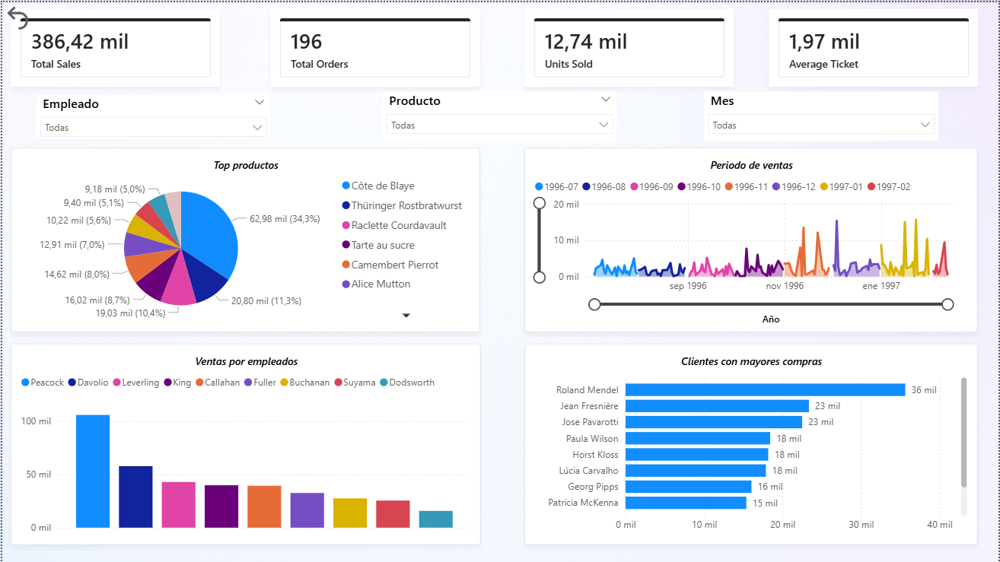

# 📊 Análisis de Ventas — Dataset Northwind

---
# 📈 Vista del Dashboard


---

# 📌 Descripción del Proyecto

Este proyecto analiza datos de ventas de la base de datos Northwind utilizando SQL, Python y Power BI.

El objetivo es explorar el desempeño comercial de la empresa y responder preguntas clave sobre:

- ingresos totales

- Productos más vendidos

- Desempeño de empleados

- Clientes más importantes

- Evolución de ventas en el tiempo

El proyecto muestra un flujo completo de análisis de datos, desde la consulta de la base de datos hasta la creación de un dashboard interactivo.

---

# 🎯 Preguntas de Negocio

Durante el análisis se buscaron responder las siguientes preguntas:

* ¿Cuánto dinero genera la empresa en ventas?

* ¿Qué productos generan mayores ingresos?

* ¿Qué empleados realizan más ventas?

* ¿Cuáles son los clientes más importantes?

* ¿Cómo evolucionan las ventas a lo largo del tiempo?

---

# 🛠 Tecnologías Utilizadas

Las herramientas utilizadas en este proyecto son:

* SQL (SQLite) → extracción y agregación de datos

* Python → análisis exploratorio de datos

* Pandas → manipulación de datos

* Matplotlib → visualización de datos

* Power BI → creación de dashboard interactivo

---

# 📂 Estructura del Proyecto

```bash
sales-analysis-northwind/
    data/
        northwind.db
    sql/
        sales_queries.sql
    python/
        analysis_sales.py
    powerbi/
        sales_dashboard.pbix
    images/
        dashboard.png
    README.md
```
---

# 🔎 Flujo del Análisis
1️⃣ SQL — Extracción de Datos

Se utilizaron consultas SQL para obtener métricas clave de la base de datos.

Entre los análisis realizados:

* ingresos totales

* Ventas por producto

* Ventas por empleado

* Ventas por cliente

* Ventas por mes

* Ejemplo de consulta SQL:
``` bash
SELECT 
    p.ProductName,
    SUM(p.Price * od.Quantity) AS total_sales
FROM OrderDetails od
JOIN Products p 
    ON od.ProductID = p.ProductID
GROUP BY p.ProductID, p.ProductName
ORDER BY total_sales DESC
LIMIT 10;
```

---

2️⃣ Python — Análisis Exploratorio

Python fue utilizado para conectarse a la base de datos y realizar un análisis exploratorio utilizando Pandas.

También se generaron gráficos con Matplotlib para visualizar:

* Productos más vendidos

* Ventas por empleado

* Ventas mensuales

* Clientes con mayores compras

Ejemplo de código utilizado:
``` bash
conn = sql.connect(DB_PATH)

df_top_products = pd.read_sql_query(query_top_products, conn)

df_top_products.plot(
    x="ProductName",
    y="total_sales",
    kind="bar"
)
```
---

3️⃣ Power BI — Dashboard Interactivo

Finalmente se creó un dashboard en Power BI para visualizar la información de forma interactiva.

El dashboard incluye:

* KPI principales

* Ventas totales

* Órdenes totales

* Unidades vendidas

* Ticket promedio

* Visualizaciones

* Productos más vendidos

* Evolución de ventas por mes

El dashboard permite explorar los datos mediante filtros por:

* Empleado

* Producto

* Mes


---

# 📊 Principales Hallazgos

A partir del análisis se pueden observar algunos patrones:

* Un pequeño grupo de productos concentra gran parte de los ingresos.
* Algunos empleados generan significativamente más ventas que otros.
* Las ventas no están distribuidas de forma uniforme entre los clientes.
* Existen variaciones en las ventas según el mes.

Estos hallazgos permiten entender mejor el desempeño comercial de la empresa.

🚀 Habilidades Demostradas

Este proyecto demuestra conocimientos en:

* Consultas SQL

* Análisis de datos

* Manejo de bases de datos relacionales

* Análisis con Python

* Visualización de datos

* Construcción de dashboards en Power BI

* Pensamiento analítico

---

## Cómo ejecutar el análisis en Python

1. Clonar el repositorio:
``` bash
git clone https://github.com/LautaroLuchesi/sales-analysis-northwind.git
```
2. Entrar al proyecto:
``` bash
cd sales-analysis-northwind
```
3. Instalar dependencias:
``` bash
pip install pandas matplotlib
```
4. Ejecutar el script:
``` bash
python python/analysis_sales.py
```

---

# 👨‍💻 Autor

Lautaro Luchesi

Estudiante de programación enfocado en análisis de datos y desarrollo de proyectos utilizando:

* Python

* SQL

* Power BI

* Visualización de datos

* Análisis de negocio

# 🧠 Comentario final

Este proyecto forma parte de mi proceso de aprendizaje en análisis de datos, aplicando herramientas comunes de la industria para transformar datos en información útil para la toma de decisiones.
