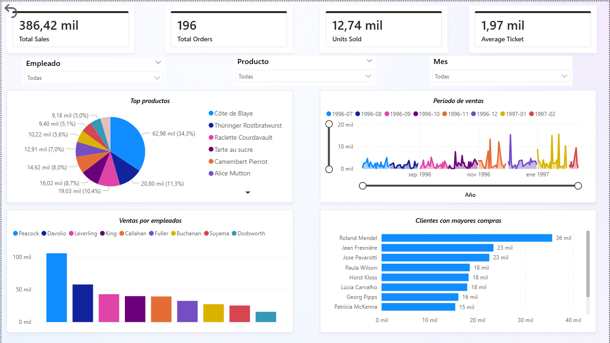

# 📊 Sales Analysis — Northwind Dataset

---

## 📈 Dashboard Overview



---

## 🧠 Business Context

Las empresas generan grandes volúmenes de datos de ventas, pero sin análisis adecuado resulta difícil identificar qué productos, clientes o empleados impulsan realmente los ingresos.

Este proyecto analiza el dataset **Northwind** con el objetivo de transformar datos de ventas en **información accionable para la toma de decisiones comerciales**.

El análisis busca identificar:

* Qué productos generan mayor impacto en los ingresos.  
* Qué clientes aportan más valor al negocio.  
* Qué empleados impulsan el desempeño comercial.  
* Cómo evolucionan las ventas en el tiempo. 

---

## 🎯 Business Problem

Una empresa necesita entender **qué factores están impulsando sus ventas** para poder tomar decisiones estratégicas como:

* Priorizar productos rentables.  
* Identificar clientes clave.  
* Mejorar el desempeño del equipo comercial. 

Sin un análisis adecuado, estas decisiones se toman con información incompleta.

---

## 🔎 Data Analysis Approach

El análisis se realizó siguiendo un flujo típico de **data analytics**:

### 1️⃣ Extracción de datos con SQL.

Se realizaron consultas sobre la base de datos relacional para calcular métricas clave como:

* Ingresos totales.  
* Ventas por producto.  
* Ventas por empleado.
* Ventas por cliente.
* Evolución mensual de ventas.

**Ejemplo de consulta:**

```bash
SELECT 
    p.ProductName,
    SUM(p.Price * od.Quantity) AS total_sales
FROM OrderDetails od
JOIN Products p 
    ON od.ProductID = p.ProductID
GROUP BY p.ProductID, p.ProductName
ORDER BY total_sales DESC
LIMIT 10;
```
---

### 2️⃣ Exploración y análisis con Python

Se utilizó **Python y Pandas** para analizar los datos extraídos desde la base de datos.

Durante el análisis se exploraron patrones en:

* Productos más rentables.

* Ventas por empleado.

* Clientes con mayor volumen de compra.

* Comportamiento de ventas por mes.

Las visualizaciones exploratorias se realizaron con **Matplotlib.**

Ejemplo de código:

df_top_products = pd.read_sql_query(query_top_products, conn)

```bash
df_top_products.plot(
    x="ProductName",
    y="total_sales",
    kind="bar"
)
```

---

### 3️⃣ Visualización con Power BI

Finalmente se desarrolló un **dashboard interactivo en Power BI** para facilitar la exploración de los datos.

El dashboard incluye:

**KPI principales:**

* Total de ventas.

* Total de órdenes.

* Unidades vendidas.

* Ticket promedio.

**Visualizaciones:**

* Top productos.

* Evolución de ventas en el tiempo.

* Ventas por empleado.

* Clientes con mayores compras.

**Además permite filtrar la información por:**

* Empleado.

* Producto.

* Mes.

---

### 📊 Key Insights

El análisis revela varios patrones interesantes en el desempeño comercial:

**Concentración de ingresos**

Un pequeño grupo de productos genera una gran proporción de las ventas totales.

**Desempeño desigual entre empleados**

Algunos empleados generan significativamente más ventas que otros.

**Clientes de alto valor**

Una parte reducida de los clientes concentra gran parte del volumen de compras.

**Variación temporal**

Las ventas muestran cambios a lo largo del tiempo que podrían estar asociados a demanda o estacionalidad.

---

### 💡 Business Recommendations

A partir de los resultados del análisis, una empresa podría considerar:

* Priorizar estrategias comerciales en los productos más rentables.

* Fortalecer relaciones con clientes de mayor valor.

* Analizar las prácticas de los empleados con mayor desempeño.

* Investigar patrones temporales para optimizar campañas comerciales.

---

### 🛠 Technologies Used

**SQL (SQLite)** — extracción y agregación de datos.

**Python** — análisis de datos.

**Pandas** — manipulación de datos.

**Matplotlib** — visualización exploratoria.

**Power BI** — dashboard interactivo.

---

### 📂 Project Structure

```bash
sales-analysis-northwind/
    data/
        northwind.db
    sql/
        sales_queries.sql
    python/
        analysis_sales.py
    powerbi/
        sales_dashboard.pbix
    images/
        dashboard.png
    README.md
```

---

### 🚀 Skills Demonstrated

Este proyecto demuestra habilidades en:

SQL y bases de datos relacionales.

Análisis exploratorio de datos.

Python para análisis de datos.

Visualización de datos.

Construcción de dashboards en Power BI.

Pensamiento analítico orientado a negocio.

---

▶️ How to Run the Python Analysis

Clonar el repositorio:

```bash
git clone https://github.com/LautaroLuchesi/sales-analysis-northwind.git
```

Entrar al proyecto:

```bash
cd sales-analysis-northwind
```

Instalar dependencias:

```bash
pip install pandas matplotlib
```

Ejecutar el análisis:

```bash
python python/analysis_sales.py
```

---

# Autor

**Lautaro Luchesi**

Actualmente desarrollando proyectos de portafolio orientados a:

- Limpieza y análisis de datos
- SQL
- Python (Pandas)
- Visualización de datos

LinkedIn:  
https://www.linkedin.com/in/lautaro-luchesi-1b5819329/
